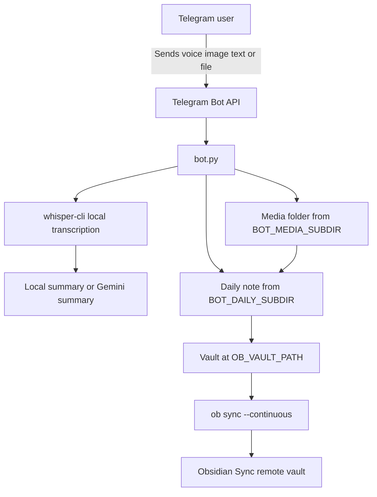

# Obsidian Telegram Daily Capture

Telegram bot + Obsidian Headless Sync in one Docker container (ARM64-ready, Raspberry Pi friendly).

The bot receives voice notes, images, plain text messages, and documents (including PDF) from Telegram, appends entries to one daily Markdown note, and keeps your Obsidian vault continuously synced.

Repository: [https://github.com/giacomoleonzi/obsidian-telegram-daily-bot](https://github.com/giacomoleonzi/obsidian-telegram-daily-bot/tree/main)

## Table of Contents

- [Key Features](#key-features)
- [Tech Stack](#tech-stack)
- [Prerequisites](#prerequisites)
- [Getting Started](#getting-started)
- [How It Works](#how-it-works)
- [Configuration Reference](#configuration-reference)
- [Available Commands](#available-commands)
- [Troubleshooting](#troubleshooting)
- [Security Notes](#security-notes)
- [Repository Structure](#repository-structure)
- [License](#license)

## Key Features

- Telegram voice message ingestion (`.ogg`).
- Telegram image ingestion (photo and image document).
- Telegram plain text message ingestion.
- Telegram document ingestion (including PDF).
- Local audio transcription via `whisper.cpp` (CPU).
- Summary generation:
  - local extractive summary
  - optional Gemini summary
- Daily note append workflow with media embed + transcript + summary.
- Continuous Obsidian sync with `ob sync --continuous`.
- Strict runtime configuration: missing required env vars fail fast.

## Tech Stack

- **Language**: Python 3.11
- **Bot Framework**: `python-telegram-bot`
- **Transcription**: `whisper.cpp` (`whisper-cli`)
- **Image handling**: Pillow
- **Optional AI summary**: `google-genai`
- **Process manager**: Supervisor
- **Container runtime**: Docker + Docker Compose
- **Obsidian sync**: `obsidian-headless` CLI

## Prerequisites

- Docker and Docker Compose available on your machine
- Telegram bot token from BotFather
- Obsidian account with Sync enabled (for remote vault sync)

## Getting Started

### 1) Clone the repository

```bash
git clone https://github.com/giacomoleonzi/obsidian-telegram-daily-bot.git
cd obsidian-telegram
```

### 2) Create local env file

```bash
cp config/.env.example config/.env
```

Edit `config/.env` and set all required values.

### 3) Build and start container

```bash
docker compose up -d --build
```

### 4) Run one-time Obsidian setup

```bash
docker compose exec obsidian-telegram bash
setup.sh
```

`setup.sh` intentionally keeps login/sync setup interactive.

> You can run setup **with or without** `OB_EMAIL` and `OB_PASSWORD`.
> - If set: script uses them and optionally asks MFA.
> - If not set: script falls back to full interactive `ob login`.

### 5) Verify logs

```bash
docker compose logs -f
```

## How It Works

The container runs two supervised processes:

- `python /app/bot.py`
- `ob sync --continuous --path /vault`

`./vault:/vault` is bind-mounted so your notes, media, and Obsidian auth state persist.



## Configuration Reference

All runtime config comes from `config/.env` (loaded by Compose).

| Variable | Required | Description | Example |
|---|---|---|---|
| `TELEGRAM_BOT_TOKEN` | yes | Telegram bot token | `123456:ABC...` |
| `OB_VAULT_PATH` | yes | Vault path in container | `/vault` |
| `OB_DEVICE_NAME` | yes | Obsidian sync device name | `raspberrypi` |
| `OB_EMAIL` | no | Optional Obsidian email for setup script | `name@example.com` |
| `OB_PASSWORD` | no | Optional Obsidian password for setup script | `...` |
| `BOT_DAILY_SUBDIR` | yes | Folder for daily note | `Daily-folder` |
| `BOT_MEDIA_SUBDIR` | yes | Folder for audio/images | `Media-folder` |
| `BOT_DAILY_NOTE_FORMAT` | yes | `strftime` note name format (`.md` auto-added) | `%Y-%m-%d` |
| `BOT_LOG_LEVEL` | yes | Python log level | `INFO` |
| `BOT_NOTE_TEMPLATE` | yes | Audio embed template (`{audio_file}` required) | `![[{audio_file}]]` |
| `BOT_IMAGE_NOTE_TEMPLATE` | yes | Image embed template (`{image_file}` required) | `![[{image_file}]]` |
| `IMAGE_COMPRESSION_ENABLED` | yes | Enable image compression | `true` |
| `IMAGE_MAX_BYTES` | yes | Target max image size | `5242880` |
| `IMAGE_MAX_DIMENSION` | yes | Max width/height during compression | `2560` |
| `IMAGE_JPEG_QUALITY_START` | yes | Initial JPEG quality | `90` |
| `IMAGE_JPEG_QUALITY_MIN` | yes | Minimum JPEG quality | `55` |
| `IMAGE_JPEG_QUALITY_STEP` | yes | JPEG quality decrement step (>0) | `5` |
| `STT_PROVIDER` | yes | Currently supported: `local` | `local` |
| `STT_LANGUAGE` | yes | Whisper language code | `it` |
| `WHISPER_CLI_PATH` | yes | Path to `whisper-cli` | `/usr/local/bin/whisper-cli` |
| `WHISPER_MODEL_PATH` | yes | Path to GGML model | `/models/ggml-base.bin` |
| `SUMMARY_PROVIDER` | yes | `local` or `gemini` | `local` |
| `GEMINI_API_KEY` | conditional | Required if `SUMMARY_PROVIDER=gemini` | `AIza...` |
| `GEMINI_MODEL` | yes | Gemini model name | `gemini-2.5-flash` |
| `GEMINI_SUMMARY_PROMPT` | yes | Prompt for Gemini summary | `Summarize...` |

## Available Commands

```bash
# Build and start
docker compose up -d --build

# Open shell in container
docker compose exec obsidian-telegram bash

# One-time interactive setup
setup.sh

# Logs
docker compose logs -f

# Stop stack
docker compose down
```

## Troubleshooting

### Bot does not receive messages

- Ensure only one instance is polling the same token.
- Check logs for Telegram `Conflict` errors.

### `setup.sh` fails at login

- Retry in interactive mode (leave `OB_EMAIL`/`OB_PASSWORD` empty).
- If using MFA, provide current one-time code when prompted.

### Whisper errors

- Verify `WHISPER_CLI_PATH` and `WHISPER_MODEL_PATH`.
- Confirm model file exists inside container (`/models/ggml-base.bin`).

### Gemini summary not working

- Set `SUMMARY_PROVIDER=gemini`.
- Set valid `GEMINI_API_KEY`.

### Mermaid diagram not rendering on GitHub

- Keep labels simple (avoid special characters-heavy labels).

## Security Notes

- Never commit `config/.env`.
- Never paste tokens/passwords/API keys in issues, PRs, or logs.
- Rotate Telegram/Gemini credentials if exposed.
- Keep `vault/` local and private unless intentionally shared.

## Repository Structure

```text
.
├── bot.py
├── Dockerfile
├── docker-compose.yml
├── config/
│   ├── .env.example
│   ├── setup.sh
│   └── supervisord.conf
├── vault/                # local bind mount target (ignored)
└── README.md
```

## License

MIT. See [LICENSE](LICENSE).
