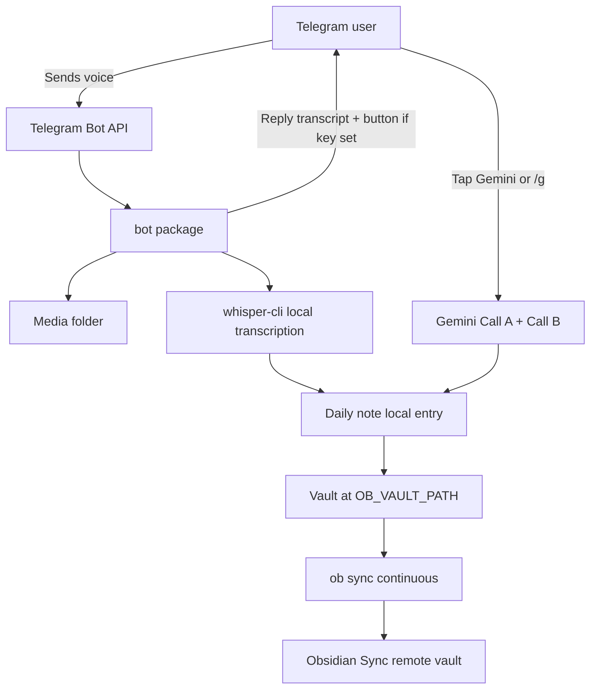

# Obsidian Telegram Daily Capture

Telegram bot + Obsidian Headless Sync in one Docker container (ARM64-ready, Raspberry Pi friendly).

The bot receives voice notes, images, plain text messages, and documents (including PDF) from Telegram, appends entries to one daily Markdown note, and keeps your Obsidian vault continuously synced.

Repository: [https://github.com/giacomoleonzi/obsidian-telegram-daily-bot](https://github.com/giacomoleonzi/obsidian-telegram-daily-bot/tree/main)

## Table of Contents

- [Key Features](#key-features)
- [Tech Stack](#tech-stack)
- [Prerequisites](#prerequisites)
- [Getting Started](#getting-started)
- [How It Works](#how-it-works)
- [Configuration Reference](#configuration-reference)
- [Gemini prompts](#gemini-prompts)
- [Available Commands](#available-commands)
- [Troubleshooting](#troubleshooting)
- [Security Notes](#security-notes)
- [Repository Structure](#repository-structure)
- [License](#license)

## Key Features

- Telegram voice message ingestion (`.ogg`).
- Telegram image ingestion (photo and image document).
- Telegram plain text message ingestion.
- Telegram document ingestion (including PDF).
- `/whoami` command to verify Telegram `chat_id` and `user_id`.
- `/g` promotes the latest local voice entry with Gemini (opt-in).
- `/pending` lists unpromoted entries, each with a `🧠 Gemini` button.
- Chat-level access control: accepts updates only from `AUTHORIZED_CHAT_ID`.
- User feedback after save: `✅` always; with `GEMINI_API_KEY` the same ack includes the `🧠 Gemini` inline button (transcript stays in the note only).
- Configurable displayed timezone for note timestamps via `BOT_TIMEZONE`.
- Local audio transcription via `whisper.cpp` (CPU).
- **Local-first Gemini opt-in**: cloud runs only on button tap / `/g` (never at capture).
  - `#### Riassunto` only when a summary is useful
  - `#### Task` with Obsidian checkboxes `- [ ]` when actions are present
  - Per-entry Dataview field `processing:: local|cloud` plus HTML comment `<!-- entry:id -->`
- Daily note append workflow with media embed + transcript (+ optional cloud sections).
- Continuous Obsidian sync with `ob sync --continuous`.
- Strict runtime configuration: missing required env vars fail fast.
- Modular Python package under `bot/` (entrypoint: `python -m bot`); prompts live in Markdown under `config/prompts/`.
- SQLite store under `{OB_VAULT_PATH}/.bot/state.sqlite3` for deferred buttons across restarts.

## Tech Stack

- **Language**: Python 3.11
- **Bot Framework**: `python-telegram-bot`
- **Transcription**: `whisper.cpp` (`whisper-cli`)
- **Image handling**: Pillow
- **Optional AI enrichment**: `google-genai` (Gemini)
- **Process manager**: Supervisor
- **Container runtime**: Docker + Docker Compose
- **Obsidian sync**: `obsidian-headless` CLI

## Prerequisites

- Docker and Docker Compose available on your machine
- Telegram bot token from BotFather
- Obsidian account with Sync enabled (for remote vault sync)
- Gemini API key only if you want the opt-in `🧠 Gemini` button / `/g` / `/pending`

## Getting Started

### 1) Clone the repository

```bash
git clone https://github.com/giacomoleonzi/obsidian-telegram-daily-bot.git
cd obsidian-telegram
```

### 2) Create local env file

```bash
cp config/.env.example config/.env
```

Edit `config/.env` and set all required values. To enable opt-in Gemini promotion, set `GEMINI_API_KEY` (leave empty to keep fully local behaviour).

### 3) Build and start container

```bash
docker compose up -d --build
```

### 4) Run one-time Obsidian setup

```bash
docker compose exec obsidian-telegram bash
setup.sh
```

`setup.sh` intentionally keeps login/sync setup interactive.

> You can run setup **with or without** `OB_EMAIL` and `OB_PASSWORD`.
> - If set: script uses them and optionally asks MFA.
> - If not set: script falls back to full interactive `ob login`.

### 5) Verify logs

```bash
docker compose logs -f
```

## How It Works

The container runs two supervised processes:

- `python -u -m bot`
- `ob sync --continuous --path /vault`

`./vault:/vault` is bind-mounted so your notes, media, and Obsidian auth state persist.


```mermaid
flowchart TD
  U[Telegram user] -->|Sends voice| TG[Telegram Bot API]
  TG --> BOT[bot package]
  BOT --> MEDIA[Media folder]
  BOT --> STT[whisper-cli local transcription]
  STT --> NOTE[Daily note local entry]
  BOT -->|Reply transcript + button if key set| U
  U -->|Tap Gemini or /g| GEM[Gemini Call A + Call B]
  GEM --> NOTE
  NOTE --> VAULT[Vault at OB_VAULT_PATH]
  VAULT --> OBS[ob sync continuous]
  OBS --> REMOTE[Obsidian Sync remote vault]
```

Voice note sections in the daily note (order):

1. Always at capture: audio embed + `processing:: local` + `#### Trascrizione`
2. After opt-in Gemini: `processing:: cloud`, optional `#### Riassunto`, optional `#### Task`

## Configuration Reference

All runtime config comes from `config/.env` (loaded by Compose).

| Variable | Required | Description | Example |
|---|---|---|---|
| `TELEGRAM_BOT_TOKEN` | yes | Telegram bot token | `123456:ABC...` |
| `AUTHORIZED_CHAT_ID` | yes | Only this chat id is allowed to interact with the bot | `123456789` |
| `OB_VAULT_PATH` | yes | Vault path in container | `/vault` |
| `OB_DEVICE_NAME` | yes | Obsidian sync device name | `raspberrypi` |
| `OB_EMAIL` | no | Optional Obsidian email for setup script | `name@example.com` |
| `OB_PASSWORD` | no | Optional Obsidian password for setup script | `...` |
| `BOT_DAILY_SUBDIR` | yes | Folder for daily note | `Daily-folder` |
| `BOT_MEDIA_SUBDIR` | yes | Folder for audio/images | `Media-folder` |
| `BOT_DAILY_NOTE_FORMAT` | yes | `strftime` note name format (`.md` auto-added) | `%Y-%m-%d` |
| `BOT_TIMEZONE` | yes | IANA timezone used for visible note timestamps | `UTC` |
| `BOT_LOG_LEVEL` | yes | Python log level | `INFO` |
| `BOT_NOTE_TEMPLATE` | yes | Audio embed template (`{audio_file}` required) | `![[{audio_file}]]` |
| `BOT_IMAGE_NOTE_TEMPLATE` | yes | Image embed template (`{image_file}` required) | `![[{image_file}]]` |
| `IMAGE_COMPRESSION_ENABLED` | yes | Enable image compression | `true` |
| `IMAGE_MAX_BYTES` | yes | Target max image size | `5242880` |
| `IMAGE_MAX_DIMENSION` | yes | Max width/height during compression | `2560` |
| `IMAGE_JPEG_QUALITY_START` | yes | Initial JPEG quality | `90` |
| `IMAGE_JPEG_QUALITY_MIN` | yes | Minimum JPEG quality | `55` |
| `IMAGE_JPEG_QUALITY_STEP` | yes | JPEG quality decrement step (>0) | `5` |
| `STT_PROVIDER` | yes | Currently supported: `local` | `local` |
| `STT_LANGUAGE` | yes | Whisper language code | `it` |
| `WHISPER_CLI_PATH` | yes | Path to `whisper-cli` | `/usr/local/bin/whisper-cli` |
| `WHISPER_MODEL_PATH` | yes | Path to GGML model | `/models/ggml-base.bin` |
| `SUMMARY_PROVIDER` | yes | Legacy (ignored for auto-cloud); keep `local` | `local` |
| `GEMINI_API_KEY` | no | If set, enables `🧠 Gemini` button, `/g`, `/pending` | empty |
| `GEMINI_MODEL` | yes | Gemini model name | `gemini-3.5-flash-lite` |
| `GEMINI_SUMMARY_PROMPT_FILE` | yes | Path to summary prompt Markdown | `config/prompts/summary.md` |
| `GEMINI_TASK_PROMPT_FILE` | yes | Path to task-extraction prompt Markdown | `config/prompts/tasks.md` |
| `BOT_STATE_DB_PATH` | no | SQLite for deferred promotion state | `{OB_VAULT_PATH}/.bot/state.sqlite3` |

## Gemini prompts

Edit the Markdown files (not long env strings):

- [`config/prompts/summary.md`](config/prompts/summary.md) — when to summarize, format, `NONE` if not worth it
- [`config/prompts/tasks.md`](config/prompts/tasks.md) — Obsidian `- [ ]` extraction, `NONE` if no tasks

Point to them from `.env` via `GEMINI_SUMMARY_PROMPT_FILE` and `GEMINI_TASK_PROMPT_FILE`. Paths are relative to `/app` inside the container unless absolute.

## Available Commands

```bash
# Build and start
docker compose up -d --build

# Open shell in container
docker compose exec obsidian-telegram bash

# One-time interactive setup
setup.sh

# Verify Telegram identity in chat
/whoami

# Promote latest local voice entry (requires GEMINI_API_KEY)
/g

# List pending local entries with Gemini buttons
/pending

# Logs
docker compose logs -f

# Stop stack
docker compose down
```

## Troubleshooting

### Bot does not receive messages

- Ensure only one instance is polling the same token.
- Check logs for Telegram `Conflict` errors.
- Send `/whoami` to the bot and verify the returned `chat_id` / `user_id`.
- Verify `AUTHORIZED_CHAT_ID` matches your private chat id with the bot.

### `setup.sh` fails at login

- Retry in interactive mode (leave `OB_EMAIL`/`OB_PASSWORD` empty).
- If using MFA, provide current one-time code when prompted.

### Whisper errors

- Verify `WHISPER_CLI_PATH` and `WHISPER_MODEL_PATH`.
- Confirm model file exists inside container (`/models/ggml-base.bin`).

### Timestamps look wrong

- Set `BOT_TIMEZONE` in `config/.env` (example: `Europe/Rome`).
- Restart container after changing env values.

### Gemini summary or tasks not appearing

- Set a valid `GEMINI_API_KEY`, then tap `🧠 Gemini` on the transcript reply (or use `/g`).
- Confirm prompt files exist at the paths in `GEMINI_SUMMARY_PROMPT_FILE` / `GEMINI_TASK_PROMPT_FILE`.
- Rebuild/restart after changing env or prompt files.
- Empty/`NONE` Gemini replies intentionally omit that section.
- Without `GEMINI_API_KEY`, the bot never calls the cloud (local-only).
- Deferred taps need the SQLite store under `/vault/.bot/` (persists with the vault volume).

### Mermaid diagram not rendering on GitHub

- Keep labels simple (avoid special characters-heavy labels).

## Security Notes

- Never commit `config/.env`.
- Never paste tokens/passwords/API keys in issues, PRs, or logs.
- Rotate Telegram/Gemini credentials if exposed.
- Keep `vault/` local and private unless intentionally shared.

## Repository Structure

```text
.
├── bot/                   # package entrypoint: python -m bot
│   ├── __main__.py
│   ├── app.py
│   ├── callbacks.py
│   ├── config.py
│   ├── gemini_enrichment.py
│   ├── handlers.py
│   ├── media.py
│   ├── notes.py
│   ├── promotion.py
│   ├── store.py
│   └── stt.py
├── Dockerfile
├── docker-compose.yml
├── config/
│   ├── .env.example
│   ├── prompts/
│   │   ├── summary.md
│   │   └── tasks.md
│   ├── setup.sh
│   └── supervisord.conf
├── docs/
│   └── superpowers/
├── vault/                 # local bind mount target (ignored)
└── README.md
```

## License

MIT. See [LICENSE](LICENSE).
